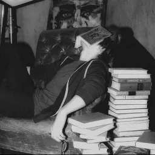

# 🌐 Portfolio Website

A personal portfolio website showcasing my projects, skills, and experience.

## 🚀 Features

- Responsive design
- About Me section
- Project showcase
- Smooth animations
- Background music support
- Custom styling with CSS

## 🛠 Technologies Used

- HTML5
- CSS3
- JavaScript
- SVG Graphics

## 📂 Project Structure

```
Portfolio_Website/
│── index.html
│── aboutme.html
│── styles.css
│── MA1.webp
│── MA2.jpg
│── serv.png
│── star.png
│── astronaut-icon2.svg
│── amongus-red.png
│── music.mp3
│── PERFORMANCE.md
```

## 📸 Preview



## 🌍 Live Demo

You can visit the website here:

```
https://majdi.online
```
## ⚙️ Installation

Clone the repository:

```bash
git clone https://github.com/MajdiProjectGame/Portfolio_Website.git
```

Open the project folder:

```bash
cd Portfolio_Website
```

Run `index.html` in your browser.

## 👨‍💻 Author

**Majdi Project Game**

- GitHub: https://github.com/MajdiProjectGame
- Website: https://majdi.online

## ⭐ Support

If you like this project, consider giving it a ⭐ on GitHub!
